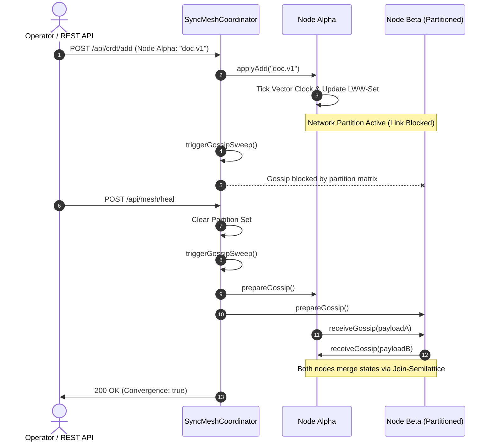

# 🏛️ System Architecture Specification: SyncMesh-Sync v2.0.0
- **Document Status:** APPROVED & COMPLETE
- **Author:** Principal Systems Architect
- **Version:** 2.0.0
- **Date:** 2026-09-20

---

## 1. Architectural Overview

`SyncMesh-Sync v2.0.0` is constructed as a decentralized, peer-to-peer conflict-free state synchronization mesh.

```mermaid
flowchart TD
    Client[Web Dashboard / REST Client] -->|HTTP / REST API| Server[HTTP Server & Mesh Gateway]
    Client <-->|SSE Stream: /api/events/stream| Server
    
    subgraph Mesh Coordinator [SyncMeshCoordinator]
        Server --> Coordinator[Coordinator Engine]
        Coordinator --> PartitionManager[Partition Controller]
        Coordinator --> GossipEngine[Anti-Entropy Gossip Sweeper]
        
        subgraph Cluster Fleet [Peer Nodes]
            NodeA[Node Alpha]
            NodeB[Node Beta]
            NodeC[Node Gamma]
        end
        
        Coordinator --- Cluster Fleet
    end
    
    subgraph Node Internal [MeshNode Subsystem]
        VC[Vector Clock]
        LWW[LWW-Element-Set CRDT]
        PNC[PN-Counter CRDT]
    end
    
    NodeA --- Node Internal
```

---

## 2. Gossip Convergence & Anti-Entropy Sequence



---

## 3. Mathematical Data Structures

### 3.1 Vector Clock State Matrix
```typescript
interface VectorClockState {
  [nodeId: string]: number; // Monotonically increasing counter
}
```

### 3.2 LWW-Element-Set Serialization Schema
```typescript
interface LWWSetPayload {
  elements: string[]; // Active converged elements
  addSet: {
    [element: string]: {
      timestamp: number;
      vectorClock: VectorClockState;
    };
  };
  removeSet: {
    [element: string]: {
      timestamp: number;
      vectorClock: VectorClockState;
    };
  };
}
```

### 3.3 PN-Counter State Schema
```typescript
interface PNCounterPayload {
  value: number; // sum(increments) - sum(decrements)
  increments: { [nodeId: string]: number };
  decrements: { [nodeId: string]: number };
}
```

---

## 4. REST API Surface

| Method | Endpoint | Description | Status Code |
| :--- | :--- | :--- | :--- |
| `GET` | `/api/health` | Service liveness probe | 200 OK |
| `GET` | `/api/stats` | Global mesh metrics, convergence state, partitions | 200 OK |
| `GET` | `/api/mesh/nodes` | List all registered mesh peers | 200 OK |
| `POST` | `/api/mesh/nodes` | Join a new node to the cluster | 201 Created |
| `DELETE`| `/api/mesh/nodes/:id` | Remove a peer node from the cluster | 200 OK / 404 |
| `POST` | `/api/crdt/add` | Add an element to target node's LWW-Set | 200 OK / 400 |
| `POST` | `/api/crdt/remove` | Remove an element from target node's LWW-Set | 200 OK / 400 |
| `POST` | `/api/crdt/counter` | Increment or decrement node's PN-Counter | 200 OK |
| `POST` | `/api/mesh/gossip` | Trigger anti-entropy gossip synchronization sweep | 200 OK |
| `POST` | `/api/mesh/partition` | Sever or restore a network link between two nodes | 200 OK |
| `POST` | `/api/mesh/heal` | Dissolve all network partitions and trigger convergence | 200 OK |
| `GET` | `/api/events/stream`| Real-time Server-Sent Events (SSE) telemetry connection | 200 OK (text/event-stream) |
